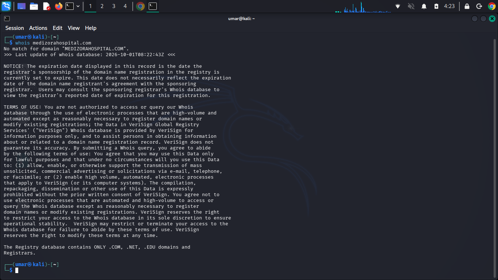
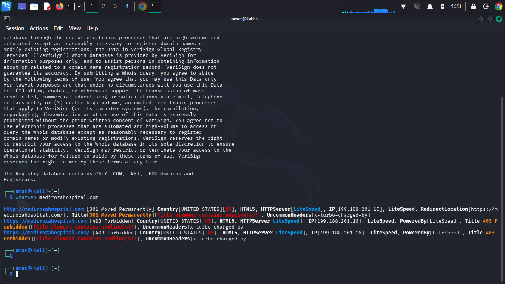
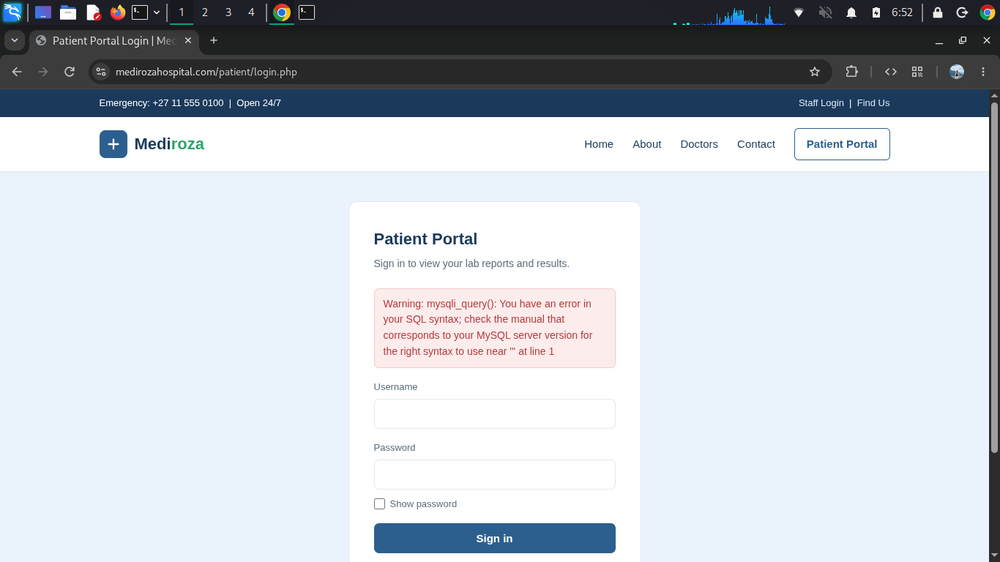
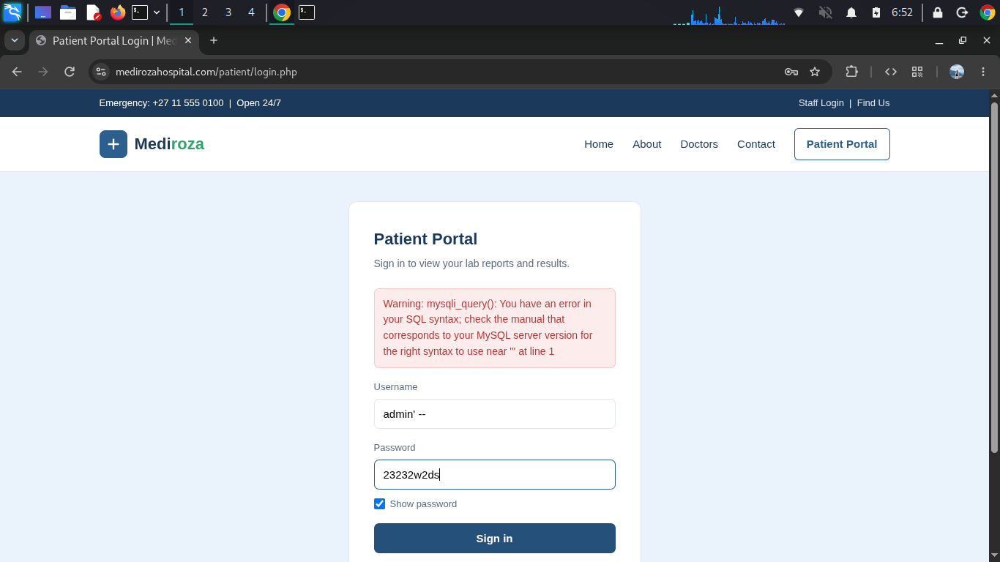
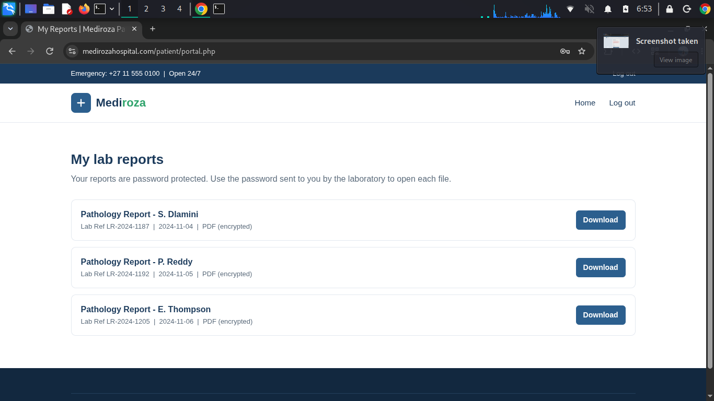
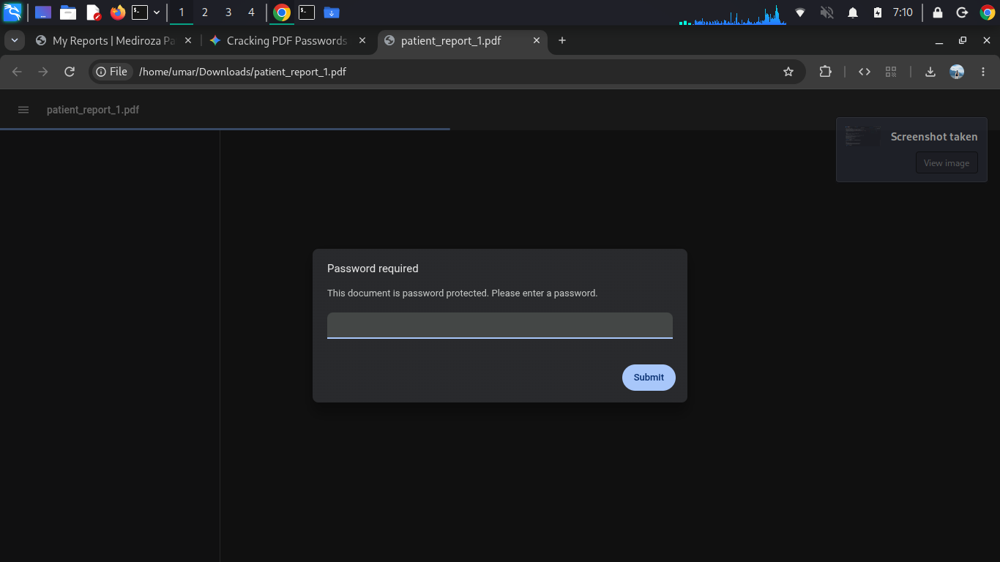
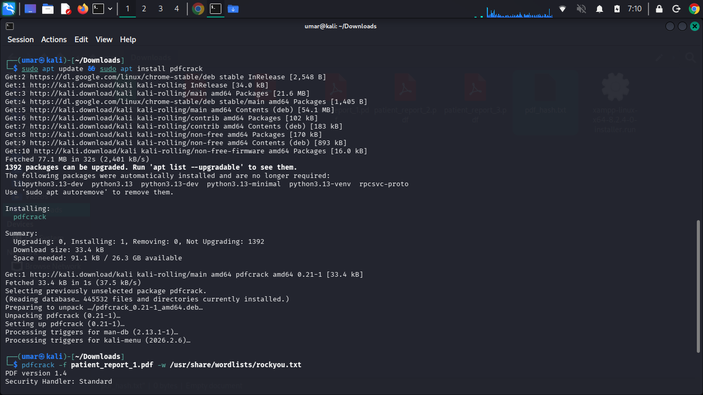
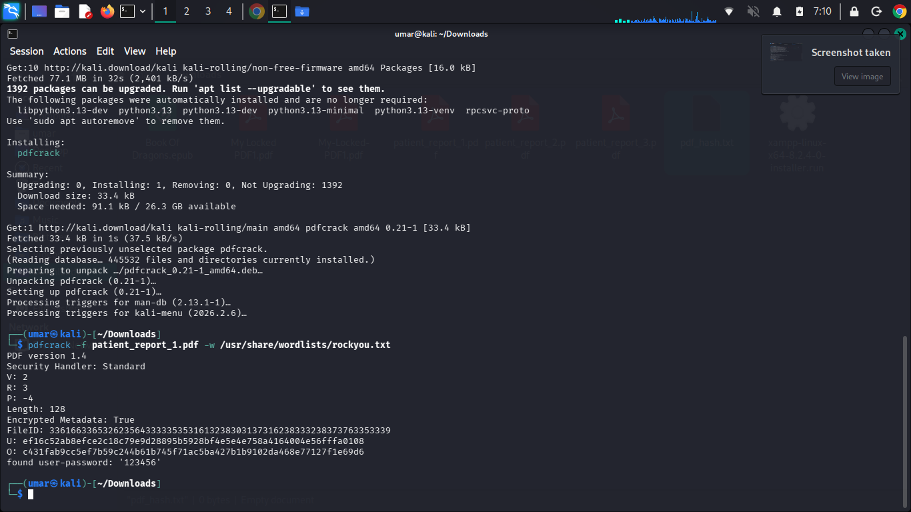

# Penetration Testing Report: Mediroza Hospital

> **Disclaimer**: This penetration testing engagement was conducted in a controlled environment for educational purposes. All security testing on `medirozahospital.com` was authorized by Networkwalks. Unauthorized application of these security testing techniques against systems without explicit written consent is strictly prohibited.

---

## 📋 Table of Contents
- [01. Executive Summary](#01-executive-summary)
- [02. Scope and Methodology](#02-scope-and-methodology)
- [03. Findings and Proof of Exploitation](#03-findings-and-proof-of-exploitation)
- [04. Risk Rating](#04-risk-rating)
- [05. Recommendations and Remediation](#05-recommendations-and-remediation)

---

## 01. Executive Summary

This security assessment was performed by security researchers on behalf of **Networkwalks** in a strictly controlled educational environment. The primary target of this engagement was **Mediroza Hospital** (`medirozahospital.com`).

The objective was to evaluate the target's external and application attack surface, identify vulnerabilities, perform proof-of-concept exploitation, and provide actionable remediation strategies.

### Key Findings Summary
* **Critical Unprotected Database Backup Leak**: Directory enumeration disclosed an unlinked path `/old` containing `mediroza_db_backup_2019.sql`, exposing full staff Personally Identifiable Information (PII), monthly salary records, and shareholder structures.
* **Critical SQL Injection (SQLi)**: Identified in the Patient Portal login interface (`/patient/login.php`), enabling authentication bypass and unauthorized access to protected patient portal accounts.
* **High Weak Password Protection**: Encrypted patient PDF reports utilized extremely weak passwords (`123456`), allowing rapid offline brute-force recovery.
* **Low Information Disclosure**: Web server response headers reveal exact software details (`LiteSpeed`, `x-turbo-charged-by`).

---

## 02. Scope and Methodology

### Target Information
| Attribute | Details |
| :--- | :--- |
| **Target Domain** | `medirozahospital.com` |
| **Target IP** | `199.188.201.16` |
| **Testing OS** | Kali Linux (`umar@kali`) |

### Tools Used
* **Reconnaissance & Enumeration**: `whois`, `whatweb`, `ping`, `gobuster`, `robots.txt` analysis
* **Web Exploitation**: Web Browser, Manual SQL Injection
* **Password Cracking**: `pdfcrack` with `rockyou.txt` wordlist

### Methodology
1. **Reconnaissance & Footprinting**: Domain discovery via `whois`, host availability checks using ICMP (`ping`), server technology identification via `whatweb`, and directory brute-forcing via `gobuster`.
2. **Vulnerability Assessment**: Input field analysis on public forms to check for input sanitization, access controls, and exposure of unlinked sensitive assets.
3. **Exploitation**: Authentication bypass via SQL Injection to access restricted medical records.
4. **Post-Exploitation Analysis**: Verification of file security mechanisms on downloaded patient artifacts and analysis of exposed database dumps.

---

## 03. Findings and Proof of Exploitation

### Step 1: Initial Reconnaissance & Asset Discovery

#### 1. Host Connectivity & Technology Fingerprinting
Initial connectivity testing verified active network routing and privilege levels on the assessment machine.



Querying the WHOIS database for `medirozahospital.com` returned no active registry match.

```bash
whois medirozahospital.com
```


Executing `whatweb` identified the primary web infrastructure:
* **Target IP**: `199.188.201.16`
* **Web Server**: `LiteSpeed`
* **HTTP Status**: `301 Moved Permanently` (Redirecting to HTTPS), `403 Forbidden` on root directory requests.
* **Custom Headers**: `x-turbo-charged-by`

```bash
whatweb medirozahospital.com
```



---

#### 2. Unlinked Directory & Backup File Discovery
Executing directory brute-forcing with `gobuster` alongside manual review of `http://medirozahospital.com/robots.txt` identified an unlinked directory path `/old`. Accessing this path revealed a publicly accessible SQL dump file named `mediroza_db_backup_2019.sql`.

---

#### 3. Exfiltrated Database Backup Data

##### A. Staff Records (`staff` Table)
| ID | Full Name | Job Title | Department | Email | Phone | National ID | Monthly Salary (ZAR) | Date Joined |
| :---: | :--- | :--- | :--- | :--- | :--- | :--- | :---: | :---: |
| 1 | Dr. Rajesh Naidoo | Chief Pathologist | Diagnostics Lab | `r.naidoo@medirozahospital.com` | +27 82 101 2007 | 85021013011081 | R 138,000 | 2009-03-16 |
| 2 | Sarah Botha | Chief Financial Officer | Finance | `s.botha@medirozahospital.com` | +27 82 102 2014 | 85031023022082 | R 152,000 | 2011-07-01 |
| 3 | Dr. Johan van der Merwe | Medical Director | Management | `j.merwe@medirozahospital.com` | +27 82 103 2021 | 85041033033083 | R 160,000 | 2007-01-22 |
| 4 | Dr. Anita Naicker | Consultant Cardiologist | Cardiology | `a.naicker@medirozahospital.com` | +27 82 104 2028 | 85051043044084 | R 132,000 | 2012-09-10 |
| 5 | Dr. Ahmed Kara | Consultant Physician | Internal Medicine | `a.kara@medirozahospital.com` | +27 82 105 2035 | 85061053055085 | R 128,000 | 2013-02-18 |
| 6 | Dr. Yusuf Cassim | Senior Registrar | Emergency & Trauma | `y.cassim@medirozahospital.com` | +27 82 106 2042 | 85071063066086 | R 74,000 | 2018-05-04 |
| 7 | Michael Roberts | HR Director | Human Resources | `m.roberts@medirozahospital.com` | +27 82 107 2049 | 85081073077087 | R 96,000 | 2010-11-15 |
| 8 | Susan Pretorius | HR Officer | Human Resources | `s.pretorius@medirozahospital.com` | +27 82 108 2056 | 85091083088088 | R 32,000 | 2016-08-23 |
| 9 | Jameel Malik | IT Systems Administrator | IT | `j.malik@medirozahospital.com` | +27 82 109 2063 | 85101093099080 | R 58,000 | 2015-04-12 |
| 10 | Thabo Molefe | Network Engineer | IT | `t.molefe@medirozahospital.com` | +27 82 110 2070 | 85111103110081 | R 46,000 | 2017-10-02 |
| 11 | Nomvula Khumalo | Registered Nurse | Emergency & Trauma | `n.khumalo@medirozahospital.com` | +27 82 111 2077 | 85121113121082 | R 34,000 | 2016-01-19 |
| 12 | Lerato Mokoena | Registered Nurse | Pediatrics | `l.mokoena@medirozahospital.com` | +27 82 112 2084 | 85011123132083 | R 33,000 | 2017-06-07 |
| 13 | Bongani Ndlovu | Registered Nurse | Cardiology | `b.ndlovu@medirozahospital.com` | +27 82 113 2091 | 85021133143084 | R 35,000 | 2015-12-01 |
| 14 | Zanele Mahlangu | Nursing Sister | Theatre | `z.mahlangu@medirozahospital.com` | +27 82 114 2098 | 85031143154085 | R 42,000 | 2013-03-25 |
| 15 | Kagiso Sithole | Pharmacist | Pharmacy | `k.sithole@medirozahospital.com` | +27 82 115 2105 | 85041153165086 | R 61,000 | 2014-09-08 |
| 16 | Naledi Zulu | Pharmacy Assistant | Pharmacy | `n.zulu@medirozahospital.com` | +27 82 116 2112 | 85051163176087 | R 26,000 | 2019-02-14 |
| 17 | Themba Nkosi | Radiographer | Radiology | `t.nkosi@medirozahospital.com` | +27 82 117 2119 | 85061173187088 | R 44,000 | 2016-07-30 |
| 18 | Palesa Radebe | Radiographer | Radiology | `p.radebe@medirozahospital.com` | +27 82 118 2126 | 85071183198080 | R 43,000 | 2017-04-11 |
| 19 | Deepak Pillay | Lab Technologist | Diagnostics Lab | `d.pillay@medirozahospital.com` | +27 82 119 2133 | 85081193209081 | R 41,000 | 2015-05-20 |
| 20 | Kavitha Govender | Lab Technician | Diagnostics Lab | `k.govender@medirozahospital.com` | +27 82 120 2140 | 85091203220082 | R 35,000 | 2018-08-06 |
| 21 | Dr. Suresh Moodley | Consultant Radiologist | Radiology | `s.moodley@medirozahospital.com` | +27 82 121 2147 | 85101213231083 | R 130,000 | 2012-02-28 |
| 22 | Dr. Fatima Patel | Pediatrician | Pediatrics | `f.patel@medirozahospital.com` | +27 82 122 2154 | 85111223242084 | R 118,000 | 2013-10-17 |
| 23 | Nisha Singh | Physiotherapist | Rehabilitation | `n.singh@medirozahospital.com` | +27 82 123 2161 | 85121233253085 | R 48,000 | 2016-11-09 |
| 24 | Dr. Vikram Chetty | Anaesthetist | Theatre | `v.chetty@medirozahospital.com` | +27 82 124 2168 | 85011243264086 | R 135,000 | 2011-06-13 |
| 25 | David Smith | Facilities Manager | Operations | `d.smith@medirozahospital.com` | +27 82 125 2175 | 85021253275087 | R 52,000 | 2014-01-27 |
| 26 | Karen O'Connor | Billing Administrator | Finance | `k.oconnor@medirozahospital.com` | +27 82 126 2182 | 85031263286088 | R 29,000 | 2018-03-19 |
| 27 | James Wilson | Security Supervisor | Operations | `j.wilson@medirozahospital.com` | +27 82 127 2189 | 85041273297080 | R 27,000 | 2019-09-02 |
| 28 | Linda Fourie | Receptionist | Front Office | `l.fourie@medirozahospital.com` | +27 82 128 2196 | 85051283308081 | R 19,000 | 2020-02-10 |
| 29 | Peter van Wyk | Procurement Officer | Supply Chain | `p.wyk@medirozahospital.com` | +27 82 129 2203 | 85061293319082 | R 38,000 | 2015-08-24 |
| 30 | Andile Mbeki | Ward Clerk | Administration | `a.mbeki@medirozahospital.com` | +27 82 130 2210 | 85071303330083 | R 21,000 | 2019-11-05 |

##### B. Shareholder Records (`shareholders` Table)
| ID | Shareholder Name | Share Percent (%) | Shares Held | Share Class |
| :---: | :--- | :---: | :---: | :--- |
| 1 | Dr. Rajesh Naidoo | 18.0% | 180,000 | Ordinary |
| 2 | Cedar Health Holdings (Pty) Ltd | 15.0% | 150,000 | Ordinary |
| 3 | Dr. Johan van der Merwe | 12.0% | 120,000 | Ordinary |
| 4 | Reddy Family Trust | 11.0% | 110,000 | Ordinary |
| 5 | Thabo Molefe | 10.0% | 100,000 | Ordinary |
| 6 | Sarah Botha | 9.0% | 90,000 | Ordinary |
| 7 | Dr. Ahmed Kara | 8.0% | 80,000 | Preferential |
| 8 | Naledi Zulu | 7.0% | 70,000 | Ordinary |
| 9 | Michael Roberts | 6.0% | 60,000 | Ordinary |
| 10 | Dr. Vikram Chetty | 4.0% | 40,000 | Preferential |

---

### Step 2: Web Application Vulnerability Analysis & Exploitation

#### 1. SQL Injection Error Detection
Navigating to `http://medirozahospital.com/patient/login.php` opened the **Patient Portal**. Submitting a single quote (`'`) into the **Username** field generated an unhandled database exception:

> `Warning: mysqli_query(): You have an error in your SQL syntax; check the manual that corresponds to your MySQL server version for the right syntax to use near ''' at line 1`

This raw database error confirms the presence of **SQL Injection (SQLi)**.



---

#### 2. Authentication Bypass Exploitation
By submitting a boolean SQL payload into the `Username` field, the backend authentication logic was manipulated:

* **Username Payload**: `admin' -- `
* **Password**: `23232w2ds` (Arbitrary input)



Submitting this payload bypassed authentication completely, providing access to `/patient/portal.php` ("My lab reports").



The portal contained multiple downloadable patient files:
1. `Pathology Report - S. Dlamini` (`Lab Ref LR-2024-1187`)
2. `Pathology Report - P. Reddy` (`Lab Ref LR-2024-1192`)
3. `Pathology Report - E. Thompson` (`Lab Ref LR-2024-1205`)

---

### Step 3: Document Security & Offline Password Cracking

#### 1. Protected PDF Access Analysis
Opening the downloaded file `patient_report_1.pdf` prompted a password requirement dialog.



---

#### 2. Offline Password Recovery (`pdfcrack`)
`pdfcrack` was executed against `patient_report_1.pdf` using the standard `rockyou.txt` dictionary file:

```bash
sudo apt update && sudo apt install pdfcrack
pdfcrack -f patient_report_1.pdf -w /usr/share/wordlists/rockyou.txt
```



The tool recovered the document password in seconds:

```text
found user-password: '123456'
```



---

## 04. Risk Rating

| Vulnerability Title | Affected Component | CVSS v3.1 Score | Risk Rating | Justification |
| :--- | :--- | :--- | :--- | :--- |
| **Unprotected Database Backup Leak** | `/old/mediroza_db_backup_2019.sql` | **9.8** | `CRITICAL` | Publicly exposes full employee PII, salary information, and corporate governance data without authentication. |
| **SQL Injection (Auth Bypass)** | `/patient/login.php` | **9.8** | `CRITICAL` | Allows unauthenticated attackers to bypass login forms and access restricted application data. |
| **Weak PDF Encryption Passwords** | Patient Lab Reports | **7.5** | `HIGH` | Protected health records use simple passwords (`123456`), allowing trivial offline cracking. |
| **Verbose Database Error Output** | `/patient/login.php` | **5.3** | `MEDIUM` | MySQL exceptions reveal backend database structure, assisting in payload crafting. |
| **Server Banner Disclosure** | Web Server Headers | **5.3** | `LOW` | Server headers expose underlying software (`LiteSpeed`), aiding technical fingerprinting. |

---

## 05. Recommendations and Remediation

### 1. Secure Sensitive Files & Remove Unlinked Backups (Critical)
* Immediately remove database backup files from publicly accessible web directories.
* Restrict access to sensitive system paths using server access control rules and secure directory configurations.

### 2. Implement Parameterized Queries (Critical)
* Replace dynamic string concatenation in database calls with **Prepared Statements** using parameterized PDO or MySQLi queries.

```php
// Remediation Example (PHP MySQLi)
$stmt = $conn->prepare("SELECT id, username FROM patients WHERE username = ? AND password = ?");
$stmt->bind_param("ss", $username, $password);
$stmt->execute();
$result = $stmt->get_result();
```

### 3. Disable Public Database Errors (Medium)
* Set `display_errors = Off` in `php.ini` for production environments. Implement custom error pages to prevent backend detail leakage.

### 4. Enforce Strong File Security Standards (High)
* Require robust, pseudo-random password generation for exported confidential documents.
* Transition to token-based or multi-factor verified download mechanisms rather than static PDF password protection.

### 5. Obfuscate Server Headers (Low)
* Reconfigure the web server (`LiteSpeed`) to strip `Server` and custom descriptive response headers (`x-turbo-charged-by`).
